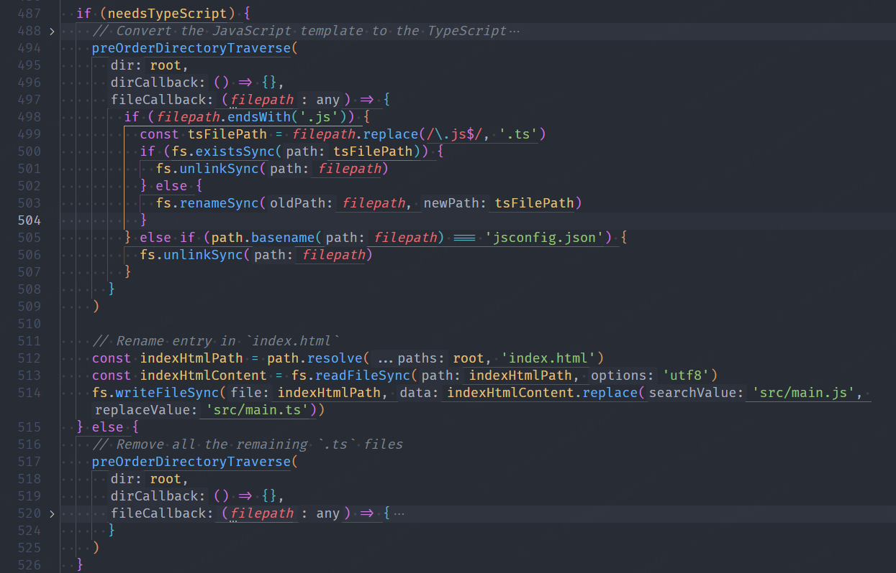
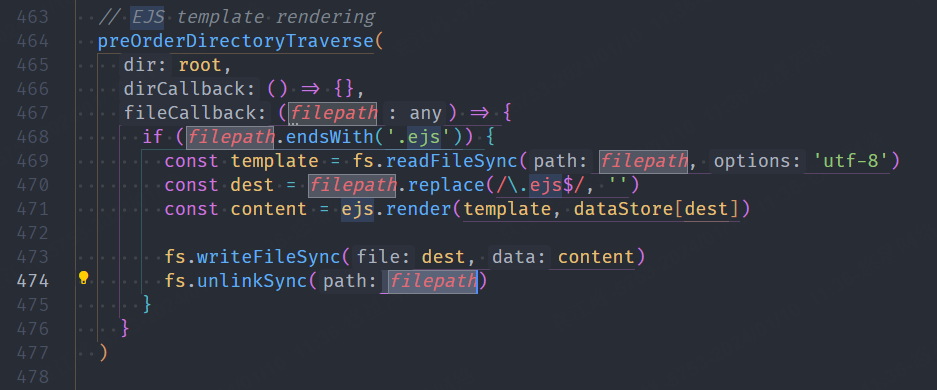
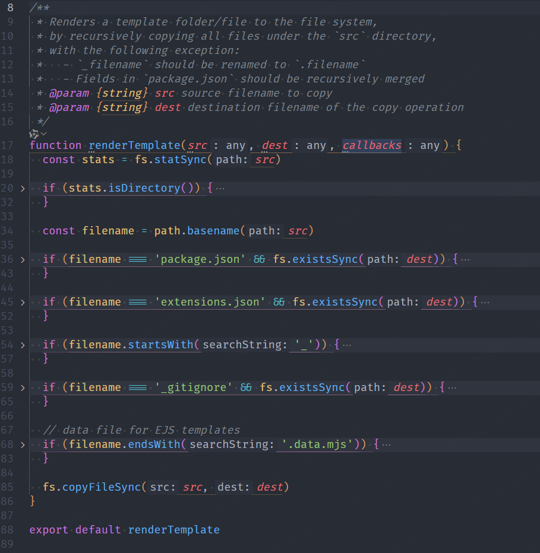
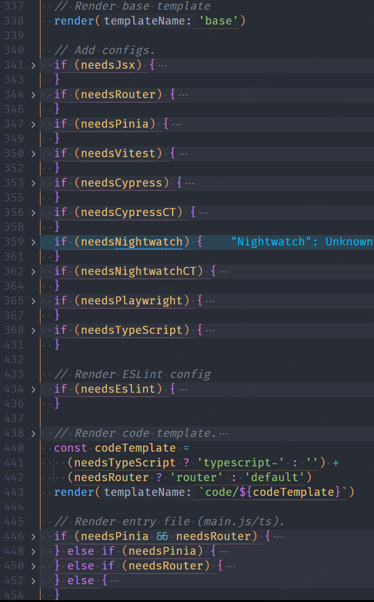

# 源码阅读

仅仅关注`create-vue`的主要功能，那么只需要阅读`template`目录和`index.ts`文件即可。

- `template` 目录下是存放的是项目源码模版。
- `index.ts` 脚手架指令入口。

## index.ts
指令文件。

首先通过 `prompt.js` 询问用户项目信息，然后调用 `utils/renderTemplate.ts` 下的 `renderTemplate(src: string, dest: string, callbacks: Array<function>)`方法来提取源码。

需要提前在 `template` 目录下创建好对应的源码文件。

根据一定的顺序，将源码覆盖到`dest`目录下。

如果用户选择了需要typescript的配置，只需要将所有的`.js`文件转化为`.ts`文件即可。这样减少了模版文件的数量，也方便了后续的维护。

对于非`.js`文件如`.vue`文件，则需要提前将源码写好，然后通过`renderTemplate`方法进行覆盖即可。

对于存在多模块参与的项目源码文件，例如entry/main.js文件，则需要单独提出来，更具配置最后进行覆盖。
并且可能需要写多个，例如`entry/router`、`entry/pinia` 和`entry/router-and-pinia`。

需要注意的是，这里也会有ejs的模版渲染用法，但是这里只对`template/base/vite.config.js.ejs`进行了渲染。

## renderTemplate.ts

首先判断`src`是文件还是文件夹，如果是文件夹，则递归调用`renderTemplate`方法。
递归的时候，会根据文件夹结构，分别给`src`和`dest`赋值，说明`template`中的文件夹的结构是需要沿用的。

对于json类文件，会经过一系列的if判断，主要会判断`dest`目录下是否已经存在了，如果存在则调用`util/deepMerge.ts`方法，将`template`中的文件内容合并到`dest`目录对应的文件中。

如果`dest`目录下该文件不存在，则直接将`template`文件内容写入到`dest`目录对应文件中。`

而对于普通的源码文件，是直接通过`fs.copyFileSync(src, dest)`进行了覆盖。

这里的覆盖顺序为：

